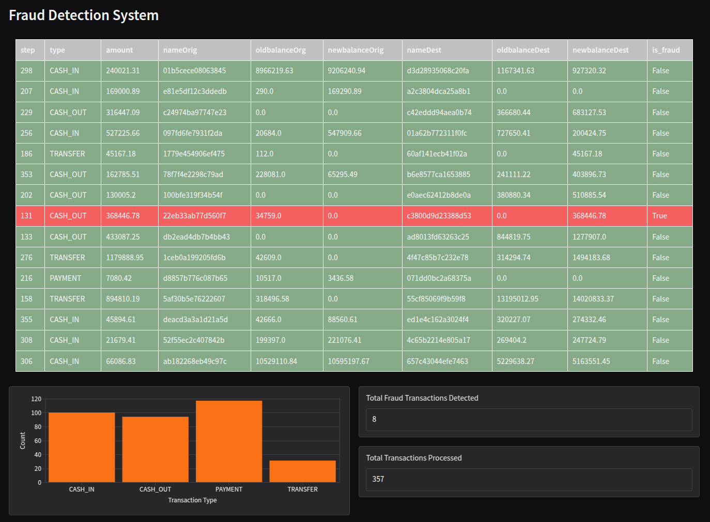

# Fraud Detection System

Simple example of an anti-fraud system to prevent credit card illegal transactions

## How to run

```bash
docker compose up
```

After some time, when all services will be up, you can open `http://localhost:7860` to see dashboard in your browser.

### Services
`anonymizer` - reads raw data and masks credit card numbers (both origin and destination) before sending to model to avoid illegal internal usage and displaying on dashboard  
`preprocessor` - reads anonymized features, selects necessary ones and encodes categorical variables  
`inference` - inference engine that reads preprocessed data and sends data with flag `is_fraud` to dashboard  
`ui` - simple dashboard with real-time table highliting detected fraud transactions and some basic statistics  



Additional:  
`producers` - example producers that samples data from a chosen dataset (see [docs](https://github.com/Ailurus1/fraud-detection/services/example/README.md)). Number of producers can be configured with `--n-producers=<N>` (default is 2).

### Note
This repository contains `git-lfs` files (model weights and metadata). To properly clone all the content please do  

```bash
git clone https://github.com/Ailurus1/fraud-detection && cd fraud-detection
git lfs install
git lfs fetch --all && git lfs pull
```
